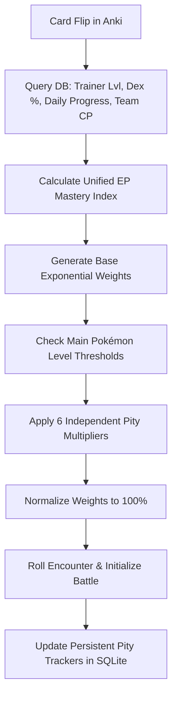

# Ankimon Encounter Overhaul: Technical Specification

This document details the architecture, mathematical models, and balancing variables behind the **Ankimon Encounter Overhaul**. It serves as an authoritative reference for game systems designers and core developers.

---

## 1. Design Philosophy & Goals

In the legacy Ankimon spawn economy, late-game players faced an inflated rare encounter rate exceeding **35%**. While initially engaging, this abundance trivialized high-tier Pokémon (Legendaries, Megas, Mythicals), saturating the player's collection and undermining the progression loop.

The Overhaul transitions the game into a structured, lore-accurate progression economy by:
1.  **Introducing the Mastery Index (EP):** A dynamic float between `0.0` and `100.0` that acts as the core multiplier for all rare encounter weights.
2.  **Exponential Rarity Scaling ("Soft Landing"):** Compressing the aggregate late-game rare spawn chance to a balanced **~10-12%** while scaling seamlessly based on progress.
3.  **Independent Pity Trackers ($P_i$):** Shielding players from long dry spells by implementing 6 distinct bad-luck protection curves, completely decoupled from one another.

---

## 2. Mastery Index & EP Calculation ($EP$)

The core of the new system is the **Encounter Potential ($EP$)**, which weights collection breadth, combat depth, study consistency, and leveling to reward overall game mastery while preventing early-game exploitation.

$$EP = (W_{trainer} \times T_{norm}) + (W_{dex} \times D_{norm}) + (W_{session} \times S_{norm}) + (W_{team} \times C_{norm})$$

### The Configurable Weights & Caps
These parameters are defined as module-level constants at the top of `encounter_functions.py`:

| Parameter | Default Value | Description |
| --- | --- | --- |
| `EP_WEIGHT_TRAINER_LEVEL` | `0.25` (25%) | Impact of overall Trainer XP level on EP. |
| `EP_WEIGHT_DEX_COMPLETION` | `0.25` (25%) | Impact of unique caught species percentage. |
| `EP_WEIGHT_SESSION_PROGRESS` | `0.25` (25%) | Impact of card flips done relative to daily goal. |
| `EP_WEIGHT_CORE_TEAM_POWER` | `0.25` (25%) | Impact of average CP of the top 6 Pokémon. |
| `TRAINER_LEVEL_CAP` | `50.0` | Trainer level at which $T_{norm}$ reaches 100%. |
| `CORE_TEAM_POWER_CAP` | `16000.0` | Average Top 6 CP at which $C_{norm}$ reaches 100%. |

### Normalized Components
*   **Trainer Progress ($T_{norm}$):** $\min\left(\frac{TrainerLevel}{TRAINER\_LEVEL\_CAP} \times 100, 100\right)$
*   **Dex Progress ($D_{norm}$):** The percentage of unique captured base species (resolving Megas and Gigantamax forms >= 10000 to their base species IDs to prevent duplicate exploitation).
*   **Session Progress ($S_{norm}$):** $\min\left(\frac{DailyReviewsDone}{DailyGoal} \times 100, 100\right)$.
*   **Core Team Power ($C_{norm}$):** $\min\left(\frac{AverageTop6CP}{CORE\_TEAM\_POWER\_CAP} \times 100, 100\right)$.

---

## 3. Rarity Curves & The Soft Landing

To scale each category smoothly from beginner configurations to late-game levels, each Tier $i$ utilizes an exponential growth curve relative to the player's current $EP$:

$$Rate_i(EP) = Base_i \times \left( \frac{Max_i}{Base_i} \right)^{\frac{EP}{100}}$$

### Rarity Parameters Table (`OVERHAUL_TIER_PARAMS`)

| Tier | Base Rate ($EP = 0$) | Max Rate ($EP = 100$) | Scaling Description |
| --- | --- | --- | --- |
| **Normal** | 96.98% | 84.70% | Compresses smoothly to make room for rare categories. |
| **Baby** | 2.30% | 3.00% | Slightly expands, maintaining a steady early/late-game presence. |
| **Ultra Beast** | 0.35% | 4.50% | The most accessible high-tier rare group. |
| **Gmax** | 0.15% | 2.50% | Highly coveted boss forms. |
| **Starter** | 0.10% | 1.80% | Locked to 0% in active code (activated via comment toggle). |
| **Mega** | 0.05% | 1.50% | Endgame standard legendary tier scaling. |
| **Legendary** | 0.05% | 1.50% | Endgame standard legendary tier scaling. |
| **Mythical** | 0.02% | 0.50% | The ultimate, hyper-rare endgame stretch goal. |

### Main Pokémon Level Locks (`OVERHAUL_LEVEL_THRESHOLDS`)
Regardless of a player's $EP$, a tier's weight is immediately set to `0.0` before normalization if the player's **Main Pokémon Level** is below the lock threshold:
*   **Ultra / Starter:** Level 30+ (Starter has an updated threshold of Level 80+ in this configuration)
*   **Legendary:** Level 50+
*   **Mega:** Level 60+
*   **Gmax:** Level 65+
*   **Mythical:** Level 75+

---

## 4. The Independent Pity System

In the legacy system, a single rare roll reset the global counter, "stealing" bad-luck protection from other tiers. The Overhaul introduces **6 Independent Pity Trackers ($P_i$)** stored in SQLite under the `"ankimon_pity_trackers"` JSON key.

For each Rare Tier $i$, the pity multiplier is calculated quadratically:

$$M_{pity\_i} = 1 + \left( \max\left(0, \frac{P_i - T_i}{OVERHAUL\_PITY\_DIVISOR}\right) \right)^2$$

### Dry Spell Thresholds (`OVERHAUL_PITY_THRESHOLDS`)
*   **Ultra Beast ($T_{ultra}$):** 100 reviews
*   **Gmax ($T_{gmax}$):** 150 reviews
*   **Starter ($T_{starter}$):** 200 reviews
*   **Mega ($T_{mega}$):** 250 reviews
*   **Legendary ($T_{leg}$):** 250 reviews
*   **Mythical ($T_{myth}$):** 600 reviews
*   *Pity Divisor (`OVERHAUL_PITY_DIVISOR`):* `50.0` reviews.

If the selected encounter tier matches a Rare Tier, **only that tier's pity counter is reset to 0**. All other counters are incremented by 1.

---

## 5. Legay vs. Overhaul: Scenario Comparisons

Here is how the calculations diverge across three typical stages of player progression.

---

### Scenario A: The Beginner Player
*   **Trainer Level:** 1
*   **Dex Completion:** 0%
*   **Session Progress:** 0 reviews completed (out of 100 daily goal)
*   **Core Team Power:** average CP of 10
*   **Main Pokémon Level:** 5

#### Legacy Calculations
*   Review progress ratio = $0 / 100 = 0.0$ (< 0.4).
*   All categories except Normal are locked (Normal gets their rates added).
*   **Encounter Odds:**
    *   **Normal:** 100.0%
    *   **All Others:** 0.0%

#### Overhaul Calculations
*   $T_{norm} = \min\left(\frac{1}{50.0} \times 100, 100\right) = 2.0\%$
*   $D_{norm} = 0.0\%$, $S_{norm} = 0.0\%$, $C_{norm} = \min\left(\frac{10}{16000.0} \times 100, 100\right) = 0.06\%$
*   $EP = 0.25(2.0) + 0.25(0.0) + 0.25(0.0) + 0.25(0.06) = 0.515\%$
*   Main level is 5, locking Ultra, Legendary, Mega, Gmax, Mythical, and Starter.
*   Weights:
    *   Normal: $96.98 \times (84.70 / 96.98)^{0.00515} \approx 96.91$
    *   Baby: $2.30 \times (3.00 / 2.30)^{0.00515} \approx 2.303$
*   **Encounter Odds (Normalized):**
    *   **Normal:** 97.68%
    *   **Baby:** 2.32%
    *   **Rares:** 0.0% (locked)

> **Key takeaway:** The Overhaul unlocks Baby Pokémon immediately, making early reviews more engaging, whereas Legacy strictly limits early reviews to Normal spawns.

---

### Scenario B: The Mid-Game Player
*   **Trainer Level:** 20
*   **Dex Completion:** 20%
*   **Session Progress:** 60 reviews completed (out of 100 daily goal)
*   **Core Team Power:** average CP of 1,200
*   **Main Pokémon Level:** 35

#### Legacy Calculations
*   Review progress ratio = $60 / 100 = 0.60$ (between 0.6 and 0.8).
*   Ultra rate increases by +3% (Normal rate decreases by -3%).
*   Main level is 35 (Starter and Ultra unlocked; Legendary/Mega/Gmax/Mythical locked).
*   **Encounter Odds (Normalized):**
    *   **Normal:** 89.54%
    *   **Baby:** 2.09%
    *   **Ultra:** 8.37%

#### Overhaul Calculations
*   $T_{norm} = \min\left(\frac{20}{50.0} \times 100, 100\right) = 40.0\%$
*   $D_{norm} = 20.0\%$, $S_{norm} = 60.0\%$, $C_{norm} = \min\left(\frac{1200}{16000.0} \times 100, 100\right) = 7.5\%$
*   $EP = 0.25(40.0 + 20.0 + 60.0 + 7.5) = 31.875\%$
*   Main level is 35 (locks Legendary, Mega, Gmax, Mythical, and Starter).
*   Weights:
    *   Normal: $96.98 \times (84.70 / 96.98)^{0.31875} \approx 92.87$
    *   Baby: $2.30 \times (3.00 / 2.30)^{0.31875} \approx 2.50$
    *   Ultra: $0.35 \times (4.50 / 0.35)^{0.31875} \approx 0.79$
*   **Encounter Odds (Normalized):**
    *   **Normal:** 96.58%
    *   **Baby:** 2.60%
    *   **Ultra:** 0.82%

> **Key takeaway:** In Legacy, the Ultra spawn rate inflates to an unearned **8.37%** immediately at card 60. Under the Overhaul, the Ultra rate stays at a balanced **0.82%**, preserving their value and scaling seamlessly with team power and dex completion.

---

### Scenario C: The Endgame Master (Zero Pity active)
*   **Trainer Level:** 50
*   **Dex Completion:** 85%
*   **Session Progress:** 100 reviews completed (out of 100 daily goal)
*   **Core Team Power:** average CP of 8,000
*   **Main Pokémon Level:** 85

#### Legacy Calculations
*   Review progress ratio = $100 / 100 = 1.0$ (>= 0.8).
*   All level locks cleared. Flat +5% bonus applied to all non-normal tiers for Trainer Level > 10.
*   **Encounter Odds (Normalized):**
    *   **Normal:** 61.31%
    *   **Ultra:** 10.61%
    *   **Mega:** 6.29%
    *   **Legendary:** 6.12%
    *   **Gmax / Baby:** 5.71% each
    *   **Mythical:** 4.24%
    *   *Aggregate Rare Chance:* **38.69%**

#### Overhaul Calculations
*   $T_{norm} = 100.0\%$, $D_{norm} = 85.0\%$, $S_{norm} = 100.0\%$, $C_{norm} = \min\left(\frac{8000}{16000.0} \times 100, 100\right) = 50.0\%$
*   $EP = 0.25(100.0 + 85.0 + 100.0 + 50.0) = 83.75\%$
*   All level locks cleared (Starter is locked at 80+ but currently set to 0.0 weight in active code).
*   Weights:
    *   Normal: $96.98 \times (84.70 / 96.98)^{0.8375} \approx 86.55$
    *   Baby: $2.30 \times (3.00 / 2.30)^{0.8375} \approx 2.87$
    *   Ultra: $0.35 \times (4.50 / 0.35)^{0.8375} \approx 2.93$
    *   Gmax: $0.15 \times (2.50 / 0.15)^{0.8375} \approx 1.57$
    *   Mega: $0.05 \times (1.50 / 0.05)^{0.8375} \approx 0.86$
    *   Legendary: $0.05 \times (1.50 / 0.05)^{0.8375} \approx 0.86$
    *   Mythical: $0.02 \times (0.50 / 0.02)^{0.8375} \approx 0.30$
*   **Encounter Odds (Normalized):**
    *   **Normal:** 90.21%
    *   **Baby:** 2.99%
    *   **Ultra:** 3.05%
    *   **Gmax:** 1.64%
    *   **Mega / Legendary:** 0.90% each
    *   **Mythical:** 0.31%
    *   *Aggregate Rare Chance:* **9.79%**

> **Key takeaway:** The endgame aggregate rare rate is compressed from an inflated **38.69%** down to a healthy **9.79%** (with absolute maximums hitting 12.3% at 100% EP). This restores prestige to endgame catches. If a dry spell occurs, the independent pity system will dynamically multiply these weights to guarantee exciting encounters.
